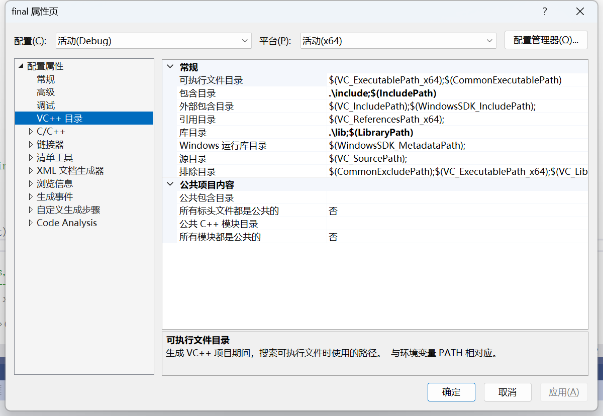
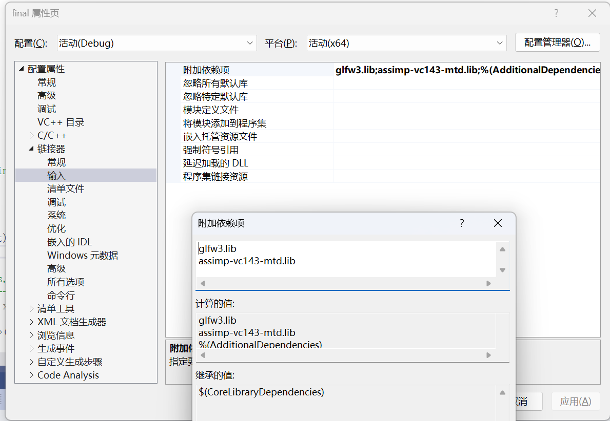

目前是final Project

**Collaborators**：

- [Jonacbl](https://github.com/Jonacbl)
- [lagrange](https://github.com/lxl1437)
- [BaiHYF](https://github.com/BaiHYF)
- [Charles4731](https://github.com/Charles4731)


**Loading Minecraft Cubes**
首先声明需要使用的方块
```cpp
int main() {
    // ......
    // load models
    Model grass_cube("resources/grass_cube/scene.gltf");
    Model stone_cube("resources/stone_cube/scene.gltf");
    Model wood_cube("resources/wood_cube/scene.gltf");
    Model brick_cube("resources/brick_cube/scene.gltf");
    Model stone_brick_cube("resources/stone_brick_cube/scene.gltf");
    Model sand_cube("resources/sand_cube/scene.gltf");

    // .......
}
```

之后在渲染循环中使用 `draw_cube` 函数，在指定位置绘制对应的方块。

参数说明:
```cpp
void draw_cube(Shader &ourShader, Camera &camera, glm::vec3 lightDir, glm::vec3 worldPos, Model cube, bool ro=false)
```
前三个 `shader`, `camera`, `lightDir` 应该不用改，直接用前面代码定义的即可。

- `worldPos` 为将被绘制方块的 世界坐标(World position)
- `cube` 就是要绘制的方块模型，可以是 grass_cube, stone_cube, wood_cube, brick_cube, stone_brick_cube, sand_cube 之一，目前我只加了这几个。
- `ro` 目前是一个 bool 值，仅在 cube 为 grass_cube 或 wood_cube 时需被设置为 true

```cpp
// main.cpp

while (!glfwWindowShouldClose(window))
{
    // ......

    // render
    // ------
    glClearColor(0.05f, 0.05f, 0.05f, 1.0f);
    glClear(GL_COLOR_BUFFER_BIT | GL_DEPTH_BUFFER_BIT);


    {
        draw_cube(ourShader, camera, lightDir, glm::vec3(3.0f, -5.0f, 3.0f), grass_cube, true);
        draw_cube(ourShader, camera, lightDir, glm::vec3(2.0f, -5.0f, 3.0f), brick_cube);
        draw_cube(ourShader, camera, lightDir, glm::vec3(1.0f, -5.0f, 3.0f), stone_cube);
        draw_cube(ourShader, camera, lightDir, glm::vec3(3.0f, -5.0f, 2.0f), stone_brick_cube);
        draw_cube(ourShader, camera, lightDir, glm::vec3(2.0f, -5.0f, 2.0f), wood_cube, true);
        draw_cube(ourShader, camera, lightDir, glm::vec3(1.0f, -5.0f, 2.0f), sand_cube);
    }

    ...
}
```


**已完成部分**

- assimp加载静态模型
- assimp加载动态模型
- skybox加载天空盒


在**解决方案资源管理器右键**-**属性**添加对应的**包含文件**路径和**库文件**路径：

```
./include
./lib
```



链接器-输入中添加：

```
glfw3.lib
assimp-vc143-mtd.lib
```



即可在`.sln`运行中运行。
目前是final Project

**Collaborators**：

- [Jonacbl](https://github.com/Jonacbl)
- [lagrange](https://github.com/lxl1437)
- [BaiHYF](https://github.com/BaiHYF)
- [Charles4731](https://github.com/Charles4731)


**已完成部分**

- assimp加载静态模型
- assimp加载动态模型
- skybox加载天空盒
- blinn-phong光照
- 交互摄像机


在**解决方案资源管理器右键**-**属性**添加对应的**包含文件**路径和**库文件**路径：

```
./include
./lib
```


链接器-输入中添加：

```
glfw3.lib
assimp-vc143-mtd.lib
```


即可在`.sln`运行中运行。
